# Functional Decomposition Diagram

This diagram decomposes the Health Risk Prediction System by function across the frontend, backend, and Python ML service.

```mermaid
flowchart TB
    A[Health Risk Prediction System]

    A --> B[1. Student Experience]
    B --> B1[Present landing and methodology pages]
    B --> B2[Collect health assessment inputs]
    B --> B3[Validate and normalize form data]
    B --> B4[Submit prediction requests]
    B --> B5[Display risk score and recommendations]
    B --> B6[Expose benchmarking and insights dashboards]

    A --> C[2. Frontend Application Control]
    C --> C1[Route navigation across home, about, predict, result, insights, benchmarking]
    C --> C2[Manage prediction state with Zustand]
    C --> C3[Compute derived inputs such as BMI category]
    C --> C4[Show loading, notifications, and charts]
    C --> C5[Fetch backend APIs and map responses to UI]

    A --> D[3. Backend API Orchestration]
    D --> D1[Receive prediction requests]
    D --> D2[Validate DTO fields and selected model]
    D --> D3[Forward inference calls to FastAPI service]
    D --> D4[Persist submitted prediction records]
    D --> D5[Serve stored records for analytics]
    D --> D6[Provide CORS and API boundary for web clients]

    A --> E[4. Data Persistence and Reporting]
    E --> E1[Store assessment inputs in PostgreSQL]
    E --> E2[Order and retrieve recent prediction records]
    E --> E3[Aggregate records by time and department in frontend insights]
    E --> E4[Export insights datasets to CSV]

    A --> F[5. ML Inference Service]
    F --> F1[Load trained models and scaler]
    F --> F2[Select model by route parameter]
    F --> F3[Transform request payload into model features]
    F --> F4[Scale features consistently with training pipeline]
    F --> F5[Predict health risk class and probability]
    F --> F6[Generate detailed category recommendations]
    F --> F7[Generate main risk summary card]
    F --> F8[Return prediction payload to backend]

    A --> G[6. Model Engineering and Evaluation]
    G --> G1[Clean and transform source lifestyle dataset]
    G --> G2[Create target risk labels]
    G --> G3[Train logistic regression, SVM, and random forest models]
    G --> G4[Persist scaler and trained model artifacts]
    G --> G5[Export benchmark metrics for reference dashboard]
    G --> G6[Evaluate trained models on surveyed local data]
    G --> G7[Publish local benchmark JSON for comparison]

    A --> H[7. Benchmark Communication]
    H --> H1[Show reference model benchmark metrics]
    H --> H2[Show local evaluation benchmark metrics]
    H --> H3[Compare F1, accuracy, and confusion matrix outcomes]
    H --> H4[Highlight strongest model candidates for deployment]
```

## Functional Mapping

- Student Experience and Frontend Application Control are implemented in the React app under `frontend/src/routes`, `frontend/src/stores`, and related UI components.
- Backend API Orchestration and Data Persistence are implemented in the NestJS app under `backend/src/endpoints/prediction`, `backend/src/dto`, and `backend/src/entities`.
- ML Inference Service is implemented in `prediction/main.py`.
- Model Engineering and Evaluation are implemented in `prediction/notebook.ipynb` and `prediction/evaluate_local.py`.
- Benchmark Communication is implemented in `frontend/src/routes/model-benchmarking.tsx` with benchmark JSON sourced from the prediction assets and frontend static data.
