# Functional Decomposition Diagram

This diagram decomposes the Health Risk Prediction System by function across the frontend, backend, and Python ML service.

```mermaid
flowchart TB
    A[Health Risk Prediction System]

    A --> B[1. Student Experience]
    B --> B1[Present landing, about, and benchmarking pages]
    B --> B2[Collect health assessment inputs across a 3 step flow]
    B --> B3[Auto calculate BMI category from height and weight]
    B --> B4[Submit prediction requests using Logistic Regression in the UI]
    B --> B5[Display risk probability, health score, and recommendations]
    B --> B6[Review benchmark comparisons for reference and local datasets]

    A --> C[2. Frontend Application Control]
    C --> C1[Route navigation across home, about, predict, result, and benchmarking]
    C --> C2[Manage prediction state with Zustand]
    C --> C3[Validate form input and compute derived BMI category]
    C --> C4[Show loading states, toast errors, animations, and charts]
    C --> C5[Post prediction payloads and guard the result route]

    A --> D[3. Backend API Orchestration]
    D --> D1[Receive prediction requests and record queries]
    D --> D2[Validate DTO fields including department and model]
    D --> D3[Forward inference calls to FastAPI predict by model path]
    D --> D4[Persist submitted prediction records in PostgreSQL]
    D --> D5[Return recent saved records ordered by creation time]
    D --> D6[Provide CORS and the /api/nest API boundary]

    A --> E[4. Data Persistence and Reporting]
    E --> E1[Store submitted assessment inputs in prediction_records]
    E --> E2[Retain department and model metadata with each submission]
    E --> E3[Generate timestamps automatically for each saved record]
    E --> E4[Expose stored records through the backend records endpoint]

    A --> F[5. ML Inference Service]
    F --> F1[Load Logistic Regression, SVM, Random Forest, and scaler at startup]
    F --> F2[Select the inference model from the route parameter]
    F --> F3[Transform request payload into ordered model features]
    F --> F4[Scale features consistently with the training pipeline]
    F --> F5[Predict health risk class and probability]
    F --> F6[Generate detailed sleep, stress, BMI, and lifestyle feedback]
    F --> F7[Generate the main risk summary card]
    F --> F8[Return the prediction payload to the backend and frontend]

    A --> G[6. Model Engineering and Local Reevaluation]
    G --> G1[Train Logistic Regression, SVM, and Random Forest models in the notebook]
    G --> G2[Persist trained model artifacts and scaler]
    G --> G3[Clean and normalize surveyed local data]
    G --> G4[Export cleaned CSV and cleaning summary JSON]
    G --> G5[Reevaluate saved models against the cleaned local dataset]
    G --> G6[Publish local benchmark JSON for the frontend comparison pages]
    G --> G7[Maintain reference benchmark values for the frontend benchmark views]

    A --> H[7. Benchmark Communication]
    H --> H1[Show reference benchmark metrics on the about and benchmarking pages]
    H --> H2[Show local evaluation metrics imported from local_benchmarks.json]
    H --> H3[Compare accuracy, precision, recall, F1, and confusion matrices]
    H --> H4[Highlight Logistic Regression as the current winning deployment choice]
```

## Functional Mapping

- Student Experience and Frontend Application Control are implemented in the React app under `frontend/src/routes`, `frontend/src/stores`, `frontend/src/static_data`, and related UI components.
- Backend API Orchestration and Data Persistence are implemented in the NestJS app under `backend/src/main.ts`, `backend/src/endpoints/prediction`, `backend/src/dto`, and `backend/src/entities`.
- ML Inference Service is implemented in `prediction/main.py`.
- Model Engineering and Local Reevaluation are implemented in `prediction/notebook.ipynb` and `prediction/evaluate_local.py`, with outputs written to `prediction/local_benchmarks.json`, `prediction/surveyed_data_cleaned.csv`, and `prediction/surveyed_data_cleaning_summary.json`.
- Benchmark Communication is implemented in `frontend/src/routes/about.tsx` and `frontend/src/routes/model-benchmarking.tsx`, using reference data from `frontend/src/static_data/model_benchmarks.ts` and local benchmark data imported through `frontend/src/static_data/local_benchmarks.ts`.
